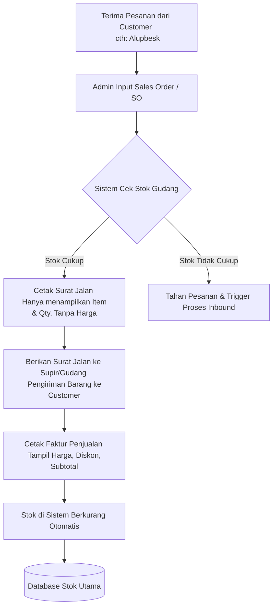
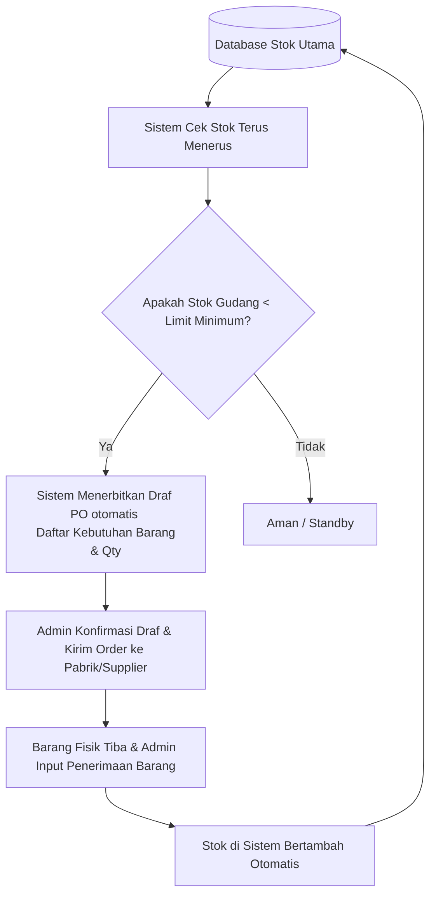
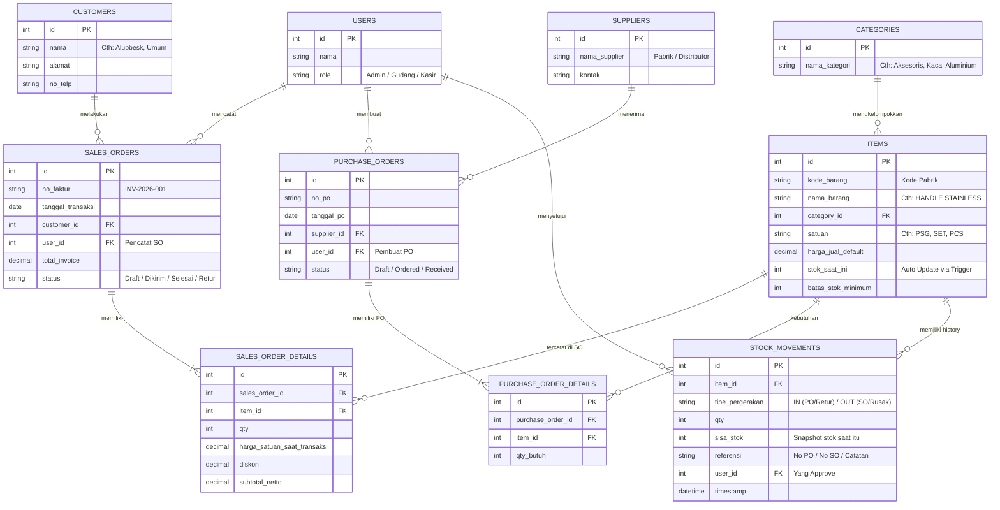

# Laravel Inventory & Sales System - CV Ma Karya Artha Graha

Sistem informasi berbasis web yang dibangun dengan Laravel untuk memenuhi kebutuhan administrasi, pelacakan stok, dan transaksi (Inbound & Outbound) pada perusahaan kontraktor **CV Ma Karya Artha Graha**. Sistem ini juga mengakomodasi pelanggan/klien bisnis seperti **Alupbesk**.

## 🌟 Fitur Utama

1. **Master Data Management**: Modul CRUD lengkap untuk mengelola Barang & Limit Stok, Kategori, Pelanggan/Klien, dan Supplier.
2. **Dashboard Peringatan Dini**: Notifikasi (Red-Zone) untuk barang yang stoknya berada di bawah batas minimum, memicu pembuatan *Purchase Order (PO)* secara otomatis.
3. **Smart Transaction Panel (Penjualan)**:
   - Pencetakan **Surat Jalan** (kertas informasi barang & kuantitas untuk supir/pengiriman).
   - Pencetakan **Faktur Penjualan / Nota Manufaktur** (kertas rincian harga, diskon, dan subtotal pembayaran).
4. **Stock Ledger & Tracing (Audit Trail)**: Riwayat pergerakan stok rinci (IN/OUT) untuk melacak setiap rotasi barang secara akurat (PO, SO, Retur, Penyesuaian Barang Rusak/Hilang).
5. **Autopilot Restock (Inbound)**: Modul untuk mengonfirmasi penerimaan barang dari *Supplier* berdasarkan PO yang dicetak otomatis oleh sistem.
6. **Retur Barang**: Fasilitas untuk memproses retur (pengembalian barang) yang terintegrasi dengan penambahan/pengurangan stok otomatis.

---

## 📐 Arsitektur & Alur Bisnis (Flowcharts)

Sistem dibagi menjadi 2 proses utama: **Outbound (Penjualan)** dan **Inbound (Pembelian/Restock)**.

### A. Modul Outbound (Penjualan / Surat Jalan & Faktur)
Proses penanganan pesanan, pengecekan ketersediaan stok, pengeluaran dari gudang, dan penagihan.



### B. Modul Inbound (Pembelian / Autopilot Restock)
Proses pengawasan *Minimum Stock Level* agar gudang tidak kehabisan material.



---

## 🗄️ Struktur Database (ERD)

Database menggunakan rancangan enterprise (Bulletproof Design) yang mencegah redundansi, memudahkan pelacakan kerugian/keuntungan, dan menyediakan jejak audit (audit trails) via `STOCK_MOVEMENTS`.



---

## 🚀 Panduan Instalasi & Penggunaan

### Kebutuhan Sistem
* PHP >= 8.2
* Composer
* MySQL Server (Misal: XAMPP, Laragon, MAMP)

### Langkah Instalasi

1. **Clone Repository (atau download ZIP):**
   ```bash
   git clone https://github.com/zzrftixx/Inventory.corp.git
   cd Inventory.corp
   ```

2. **Install Dependensi Laravel:**
   ```bash
   composer install
   ```

3. **Konfigurasi Environment:**
   Salin file `.env.example` menjadi `.env`.
   ```bash
   cp .env.example .env
   ```
   Atur kredensial Database Anda di file `.env` yang baru saja dibuat:
   ```env
   DB_CONNECTION=mysql
   DB_HOST=127.0.0.1
   DB_PORT=3306
   DB_DATABASE=masterinventorys
   DB_USERNAME=root
   DB_PASSWORD=
   ```

4. **Generate Application Key:**
   ```bash
   php artisan key:generate
   ```

5. **Buat Database SQL:**
   Buka *phpMyAdmin* (atau aplikasi GUI database yang Anda gunakan) dan buat Schema/Database baru bernama `masterinventorys`.

6. **Jalankan Migrations Database:**
   Perintah ini akan secara otomatis membuat struktur tabel ke database `masterinventorys`.
   ```bash
   php artisan migrate:fresh
   ```

7. **Jalankan Development Server:**
   ```bash
   php artisan serve
   ```
   Akses aplikasi di Browser: `http://127.0.0.1:8000`

### Penggunaan (Cara Mulai Mencoba)
Setelah instalasi selesai, ikuti urutan ini untuk menggunakan sistem:
1. Akses menu **Kategori Barang** (`/categories`). Daftarkan kategori, misal: *Kaca*, *Aksesoris*, *Aluminium*.
2. Akses menu **Supplier** (`/suppliers`). Daftarkan pabrik tempat perusahan memesan material.
3. Akses menu **Customer / Klien** (`/customers`). Daftarkan *Alupbesk* atau pelanggan lainnya.
4. Akses menu **Barang & Stok** (`/items`). Daftarkan master data profil barang, harganya, dan tentukan limit minimum *restock*-nya.
5. Selanjutnya, gunakan modul Transaksi (Inbound/Outbound) yang saling teringrasi di panel.

---

> Dibuat khusus untuk **CV Ma Karya Artha Graha** dengan desain UI/UX canggih (_Tailwind CSS_) dan perancangan database (_bulletproof architecture_) by Engineer Support.
